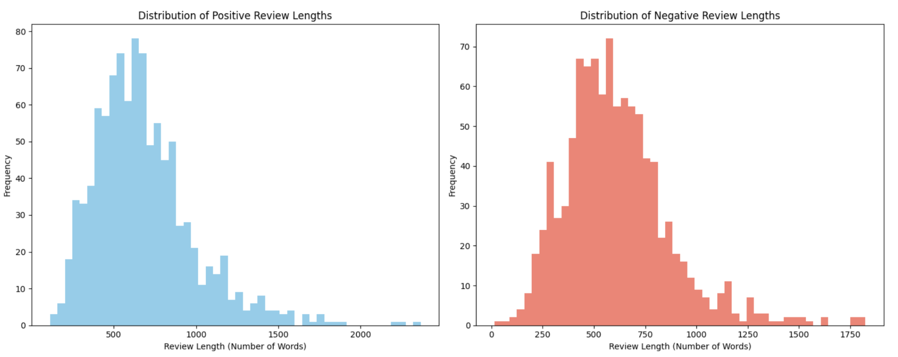
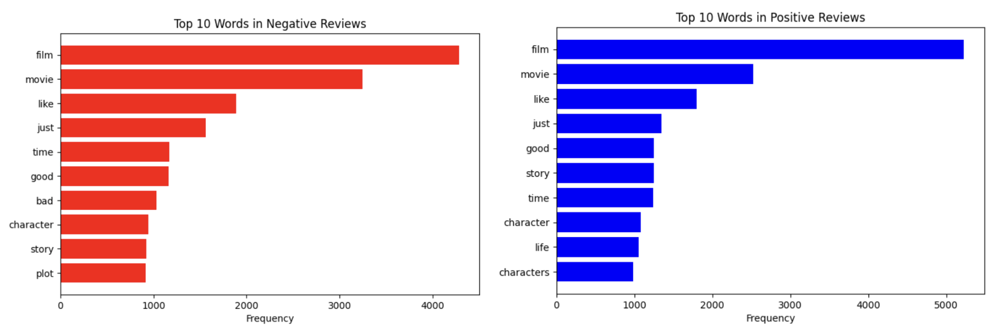

# Movie Polarity Dataset v2.0 Metadata

## Data Summary
The data used in this project is the **Movie Review Polarity Dataset v2.0**, which can be accessed online through the 
Cornell University Computer Science department’s distribution hub for sentiment analysis research [1]. When downloaded, 
the dataset appears as a folder named `review_polarity`, containing a subdirectory `txt_sentoken`, which is further divided 
into two subfolders: `pos` (1,000 positive reviews) and `neg` (1,000 negative reviews). Each review is stored as an 
individual plain-text file. For the purposes of our project, we ran a preprocessing script (`preprocessing.py` in the `SCRIPTS` folder of this repository) that consolidated and cleaned the data. We merged the 2,000 text files into a single structured CSV file, `review_polarity_clean.csv`, and applied text preprocessing steps including lowercasing, removal of punctuation and numbers, 
removal of stopwords, tokenization, and lemmatization. The resulting dataset contains 2,000 rows and 2 features: 
`clean_text` (the cleaned text of the review) and `label` (a binary indicator, with 1 for positive and 0 for negative).

## Provenance
The dataset originates from a larger pool of 27,886 unprocessed HTML files archived by IMDb from the 
rec.arts.movies.reviews Usenet group, where users posted movie reviews in the 1990s–2000s. This archive became an early 
publicly available source of movie review text and has been widely used in natural language processing research. 
The processed subset in `review_polarity` removed incomplete and non-English reviews to produce a balanced 
dataset of 2,000 labeled reviews.

A review’s classification was determined by the IMDb reviewer’s explicit rating of the movie. To ensure accuracy, 
the maximum rating had to be clearly stated, whether expressed numerically or in words. The dataset creators 
then converted these ratings into binary sentiment labels. Specifically, for a five-star system 
(or equivalent numeric scale), reviews with 3.5 stars and above were labeled positive, while reviews with 2 stars and 
below were labeled negative. For a four-star system, reviews with 3 stars and above were labeled positive, while those 
with 1.5 stars and below were labeled negative. For letter grade systems, reviews with a grade of B or higher were 
labeled positive, while reviews with a grade of C– or lower were labeled negative. 

This dataset was first introduced in Bo Pang and Lillian Lee’s 2004 paper, “A Sentimental Education: Sentiment 
Analysis Using Subjectivity Summarization Based on Minimum Cuts.”

## License
The Movie Review Polarity v2.0 dataset is released under the Creative Commons Attribution 4.0 International License (CC BY 4.0). 
This license allows for sharing and adaptation of the dataset, including commercial use, provided that proper 
attribution is given to the dataset creators.

## Ethical Statements
A potential ethical consideration is that the IMDb reviews were scraped and repurposed without the informed consent 
of the reviewers. Although no personal identifying information is included, raising minimal privacy risks, 
the dataset nonetheless raises questions about the ethics of reusing publicly available online content for 
research purposes without explicit permission.

## Data Dictionary
- `clean_text` → String containing cleaned text of a single movie review
- `label` → Binary integer indicating polarity classification (1 = positive, 0 = negative)

## Explanatory Plots

**Figure 1**. Distribution of review lengths for positive (left) and negative (right) movie reviews, measured by number of words.

**Figure 2**. Top 10 most frequent words in positive (left) and negative (right) movie reviews, after removal of stopwords.

## References
[1] B. Pang and L. Lee, “Movie Review Data: Polarity Dataset v2.0,” Cornell University, [Online]. 
Available: https://www.cs.cornell.edu/people/pabo/movie-review-data/. Accessed: Sept. 18, 2025.
